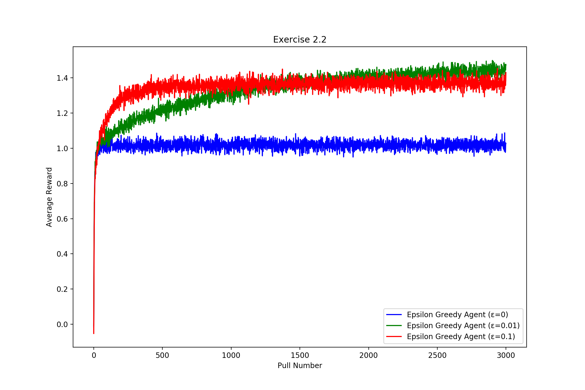
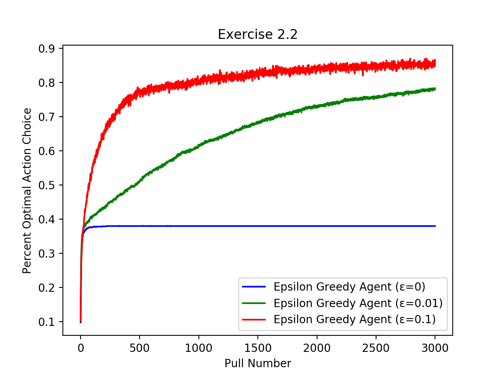
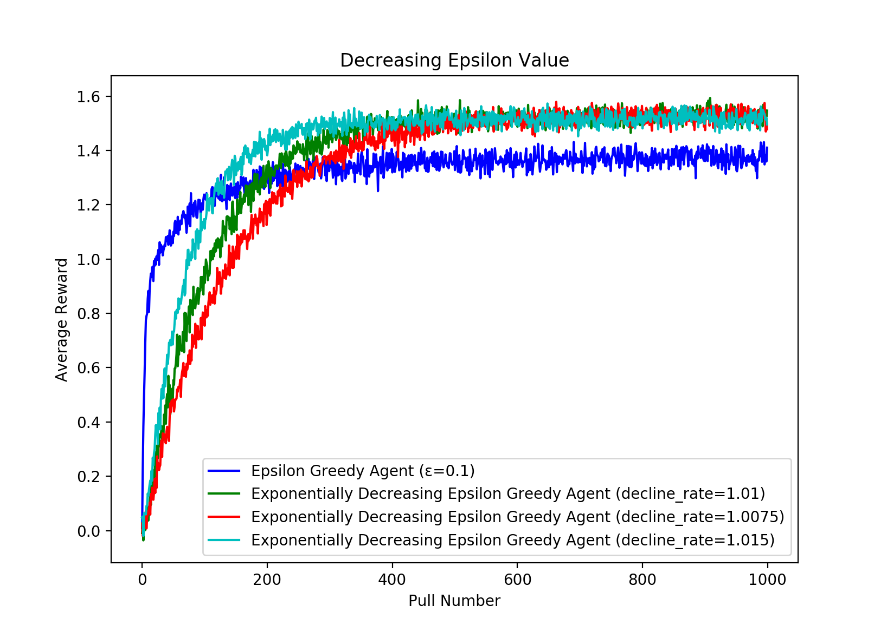
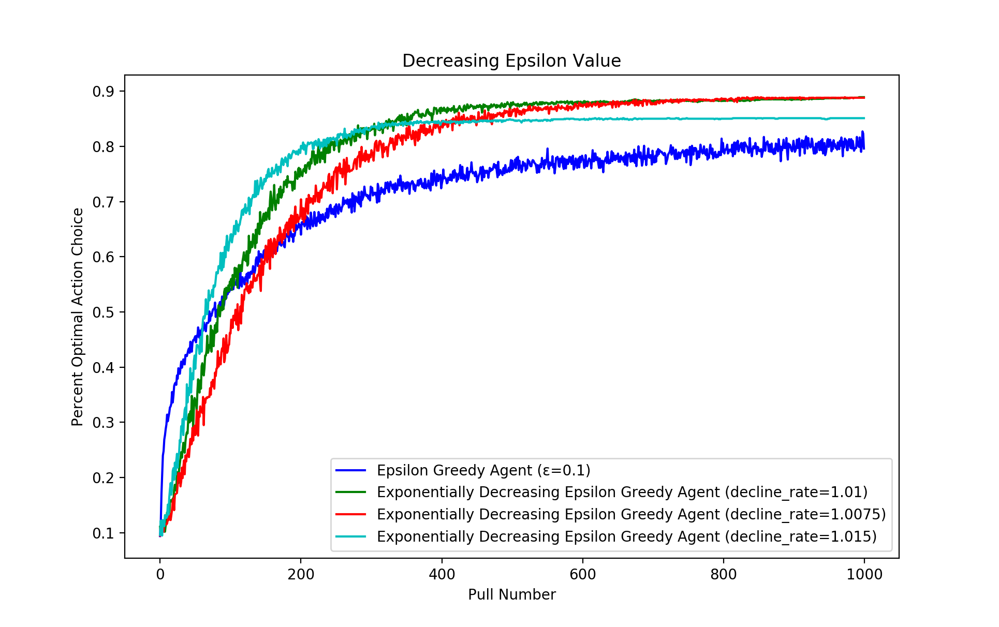
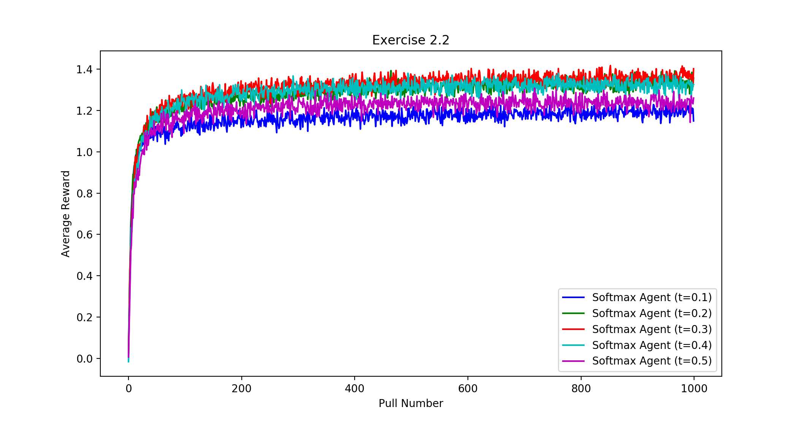
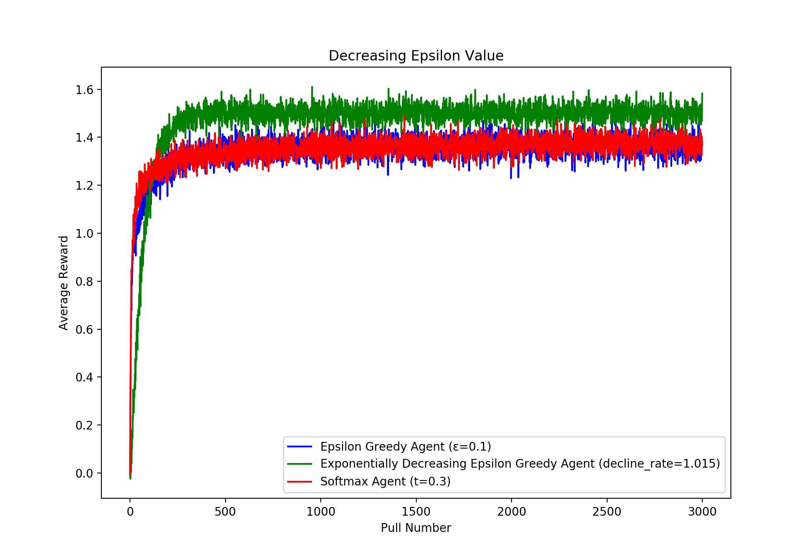
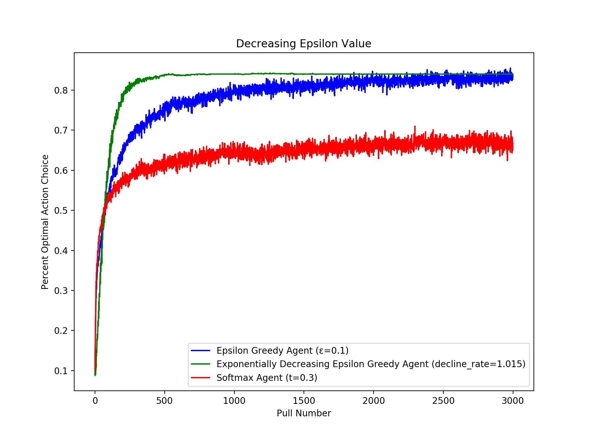

# Chapter 2 - Bandit Problems

## Overview
In this chapter, we learn about the N-Armed-Bandit problem. Consider this problem:

There are 10 different slot machines. For each slot machine, you pull a lever and
get a certain reward, maybe 0 tokens, maybe 10, maybe a million. You get 1000 pulls.
Your job is to end up with as many tokens as you can by the end of the 1000 pulls. 
What is your strategy?

If the slot machines are all exactly the same, then it doesn't really matter what you do.
You could use all your pulls on 1 machine or choose randomly for each pull and, on average,
you'll get the same result. But what if the machines are not all the same? What if
some of the machines are better than others? For example, say you tried slot machine 1 for
a few pulls and got the following results:

1. 3 tokens
2. 7 tokens
3. 6 tokens
4. 5 tokens
5. 7 tokens
6. 4 tokens

Then you try machine 2 for a few pulls and get the following results:

1. 8 tokens
2. 6 tokens
3. 9 tokens
4. 8 tokens
5. 10 tokens
6. 7 tokens

While the rewards are still random, machine 2 seems to be giving better results than machine 1
on average. So we need to come up with a strategy that exploits that information in order to get
the most possible tokens at the end.

This is the essence of the N-Armed-Bandit problem. How do we come up with a strategy to maximize
our reward?

### How we approach the problem

So we need to figure out what the best slot machine is and choose that one as much as possible.
In order to determine which slot machine is the best one, we need to try all the different
slot machines and see which ones give the best rewards. 

So if we have 1000 pulls, we can try each slot machine 100 times, average the results, 
and then we'll have a pretty good estimate of how good each slot machine is, right? 
Well yeah, but then we've spent all of our pulls so we can't exploit that information. 
So how about we try each machine once, then spend the rest of our pulls on whichever one
gave us the best reward? Well that doesn't really guarantee that we've found the best
machine because we only tried each once.

So we need to balance exploration (finding which machine is the best) with exploitation
(exploiting our knowledge to get the most possible reward).

### Epsilon Greedy Method

The epsilon greedy method is very simple. Basically, we use the reward from each pull
to maintain an estimate for how good each slot machine is. For some percentage of
our pulls, we pick the slot machine that we estimate to be the best. For the rest of our
pulls, we pick a slot machine randomly.

The percentage of pulls that we choose randomly is ε (epsilon). So for example, 
ε = 0.1 means we choose randomly 10% of the time and are greedy (choose our best estimate)
90% of the time.

Here are some results showing the performance of the epsilon greedy methods.

The values at each pull are averages over 2000 trials.

We can see that ε=0 does not perform too well. This is because it does not spend any
time exploring. It picks some slot machine as the best and chooses it every time no
matter what. With ε=0.1, we can see that we do a little better. We spend more time exploring
so we are able to get better results, but we plateau because we only ever choose our best
estimate for 90% of pulls. With ε=0.01, we do not learn as fast, but we eventually reach a
higher average reward than ε=0.1 because once we figure out which slot machine is best,
we choose it 99% of the time.

This graph shows the percent of the time that each method has chosen the optimal action
at each pull number. We see that for ε=0, it rarely finds the optimal action,
and it doesn't spend any time exploring. For ε=0.1, it spends 10% of its
time exploring so it learns very fast, but it also plateaus because it will
only exploit its knowledge 90% of the time.

Maybe we can improve this a little. Maybe we'd want to do a little more exploring
at the beginning of our session and as we get towards the end, be more greedy. We can
do that!

The different lines here show methods where we decrease epsilon at different
rates.

### Softmax Method

With the epsilon greedy method, we kind of took an all or nothing approach
to exploration and exploitation. Either we were exploring, and we'd choose
our arm totally randomly or we were exploiting and being totally greedy.
Softmax methods, on the other hand, explore all the time but use their estimates
of each arm's value to weight how often they choose that arm. This means that
they will choose the arm they estimate to be the best most often and the arm
they estimate to be the worst least often and every arm in between is weighted
accordingly as well.

They have a parameter called the "temperature" which essentially says how
much to weigh our estimates. Higher temperatures place less importance on
our estimates and choose actions equi-probably. Lower temperatures place more
importance on our estimates and so choose the actions we estimate to be better
more often. As the temperature approaches 0, we start to be greedy 100% of the
time. Picking the temperature is tricky and seems to be mostly a trial and error
type thing. I am not sure if there is a more scientific way to approach that.

### 10-Armed Bandit Showdown

So which bandit performed the best?

The quantity we are trying to maximize is total rewards which is represented
graphically as the area under the curve. In this experiment, the strategy
in which we decrease epsilon over time performed the best.
