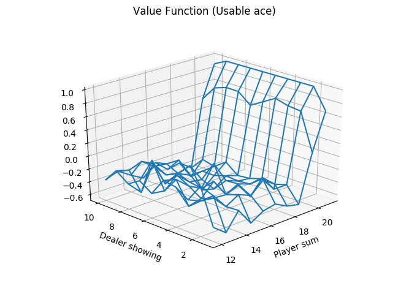
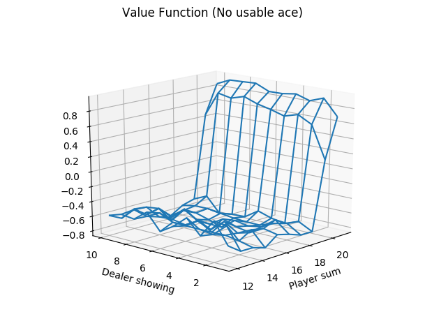
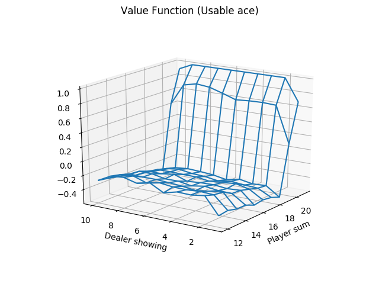
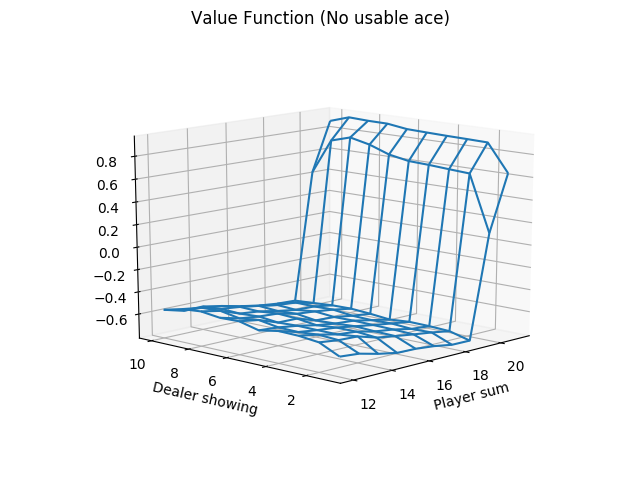
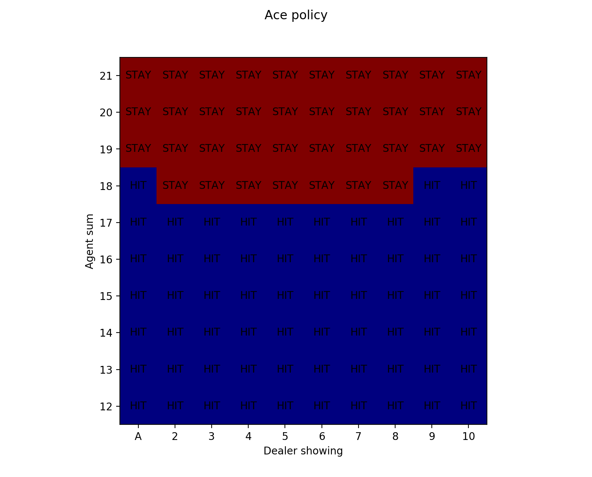
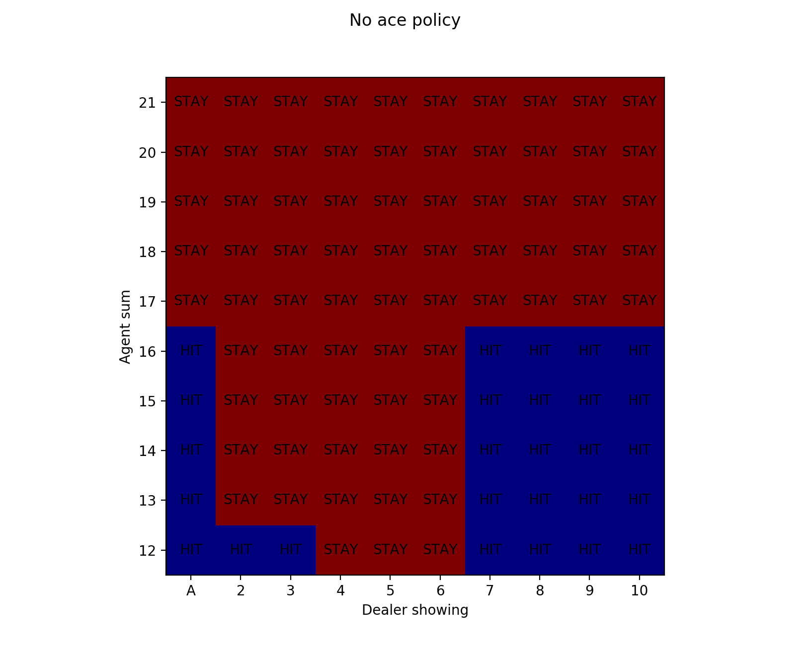
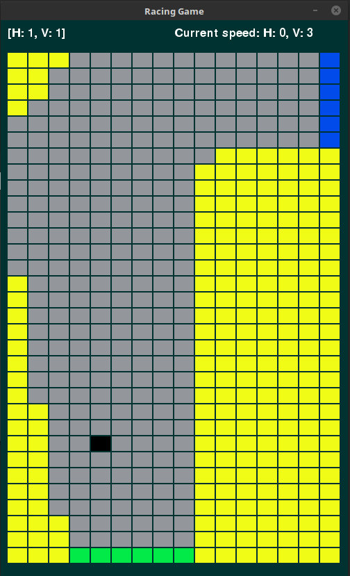
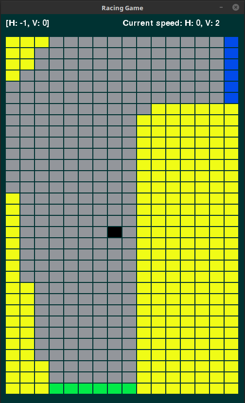

# Monte Carlo Methods

In this chapter, we learn about Monte Carlo methods for learning the optimal behavior policy for
finite MDPs. This is just like what we did in the last chapter except here, we do not assume any
knowledge about the inner workings, or the model, of the MDP. For dynamic programming methods, we needed
to know the transition probabilities for state transitions and the rewards associated with them in order to
learn the optimal policy. Here, we learn the policy from experience alone.

## Blackjack: Policy Evaluation

Here, we test out Monte Carlo policy evaluation on a Blackjack environment. We are evaluating the policy
which stays only on 20 or 21 and hits on everything else. Below, you can see my results for running policy evaluation
on this policy, which reproduces Figure 5.2 from the textbook.

For 10,000 episodes:

For 500,000 episodes:

As you can see, using more episodes gives you a better, less noisy picture of the value function.

## Blackjack: Monte Carlo Control

Here, we use a Monte Carlo method to learn the optimal policy. We use the pattern of generalized policy iteration
to do so. Basically, this means we use Monte Carlo simulation to evaluate an arbitrary policy, improve that policy
by being greedy with respect to our evaluation, evaluate that new policy, improve that policy by being greedy with
respect to that evaluation, and so on until the policy stops changing (that means we have reached the optimal policy).

### Exercise 5.4: Racetrack Problem 

For this problem, I used on policy, first visit, epsilon soft Monte Carlo control to learn a policy for how
to drive a car around a racetrack environment. The exact details of this problem are given in the text. Below,
you can see how an agent behaves before and after training with this control method.

Before:

As you can see, this bot crashes into the walls a lot and takes a long time to make it to the target (the blue line).

After:

This bot clearly has learned some things about this environment. While it is still not behaving optimally, it is
performing much better than the untrained bot on this environment.

#### Sources:
1. Sutton, Richard S., and Andrew G. Barto. Reinforcement Learning: an Introduction. 2nd ed., The MIT Press, 2012