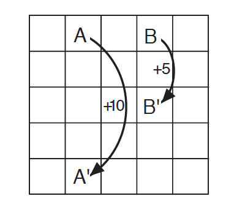
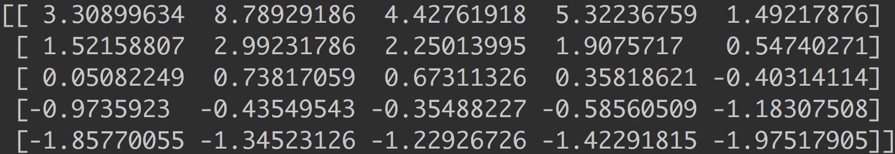
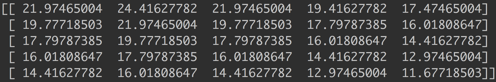

# The Reinforcement Learning Problem

In this chapter, we learn about the full reinforcement learning problem.
The problem consists of an environment and an agent. We have control over
the agent and are responsible for choosing which **actions** the agent takes.
The environment is outside of the agent and thus, we have no control over it
in general. The agent and environment interact in a simple way. At every time
step, the agent performs some action, and the environment responds with
the next **state** and an immediate **reward**.

#### Exercise 3.1
The first exercise is to come up with three example tasks that we can fit into
the reinforcement learning framework. Here are mine:

1. A program that plays blackjack. The state is made up of the cards
that it can see on the table. The possible actions are hit or stay. The rewards
would simply be +1 if the hand is won, -1 if the hand is lost, and 0 for any
action that does not cause the hand to end.
2. A traffic light controller. The reward is the number of cars it is
allowing to pass through so that it promotes effective traffic flow. The state
is readings from distant sensors that the controller has on each side which
tell it how far a car is from each side. The controller can make each of its
four sides one of three colors so there are 3^4 possible actions.
3. A piano playing program. The action in this case is very simple- which keys 
do we press and lift? The state is the keys that have already been played or are already
currently pressed. The reward could be supplied by human listeners and could be a numerical
representation of how much they are currently enjoying the music.

### Gridworld

A very simple example of the reinforcement learning problem is gridworld.

The states are all of the cells on the grid. The possible actions that
we can take are up, down, left, and right. The rules of the environment are:
- If we try to make a move that would take us off the grid, we get a reward
of -1
- If we are on the A square, however, every move takes us to A' and results in
a reward of 10
- If we are on the B square, every move takes us to B' and results in a reward of
5
- Every other move results in a reward of 0 and takes you to the square you would
expect

What is the optimal way to act in this environment? In other words, how
do we act so that our "long-term reward" is maximized?

#### Discounting

One tricky thing about maximizing "long-term reward" is that this little game could
potentially go on infinitely. To make the problem more simple, mathematically,
we use a strategy called discounting. This basically just means we weight
future rewards in an exponentially decreasing way.

γ0R0 + γ1R1 + γ2R2 + ...
(where 0 <= γ < 1)

We call the discounted sum of future rewards the "return" which is essentially a
representation of expected long-term reward.

#### Policies

So we need to decide how to act in this environment. A policy specifies
how an agent acts. For example, we could have a random policy, where the agent
moves in a random direction every time step, or we can have an "always down" policy
where the agent always moves down. In general, the policy is just a probability
distribution which tells us the probability of taking each action depending on
which state we are in.

#### Value Functions

A value function describes the "value" of a particular state or action.
The "value" of a state is basically the expected future reward from the state,
which we call the "return" as was mentioned above. This value function depends
upon a policy because in order to know how much reward we can expect from a
particular state, we need to know how we are going to act.

#### Uniform Policy Value Function

Here is the value function for the uniform random policy (where we choose
an action randomly from every state).

#### Optimal Value Function

What we are really interested in, though, is the optimal policy. The policy
that gives us the most possible return from any given state. The optimal
value function gives us the most possible return from any given state, so from
that, we can derive the optimal policy. Here is the optimal value function
for gridworld, solved using value iteration.

#### Sources:
1. Sutton, Richard S., and Andrew G. Barto. Reinforcement Learning: an Introduction. 2nd ed., The MIT Press, 2012.