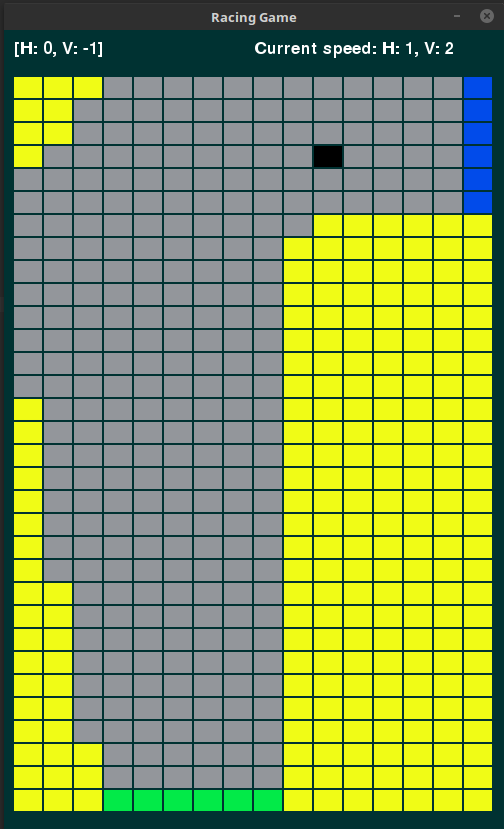
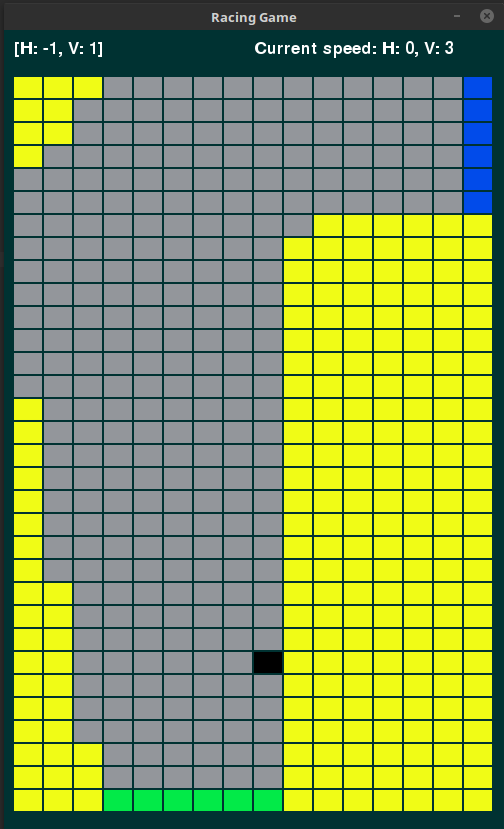

# Temporal-Difference Learning

In this chapter, we learn about temporal difference (TD) learning. Like Monte Carlo methods, temporal difference
learning methods allow us to learn an optimal policy in a model-free environment. This means that we learn the
optimal policy through experience.

The difference between TD and Monte Carlo is that TD using a technique called bootstrapping. Basically, Monte Carlo methods
determine the value of a state based on a sample of all of the rewards that follow from it for the rest of the episode.
So if I am in state 1, then go to state 2, 3, 4, etc up to state 10 and then the episode terminates and I get a reward
of +1 at the end, I update my value estimate for each of those states with that final reward.

TD learning methods use the knowledge that has already been accumulated to update value estimates instead of visited
states. So if I am in state 1, then go to state 2, I update my value estimate for state 1 with the immediate reward I
obtained plus my current value estimate for state 2. So I am updating my value estimate based on other estimates- this
is bootstrapping. This is the same idea that Dynamic Programming methods use.

## SARSA: On-Policy TD Control for the Racetrack Problem

SARSA is one algorithm for doing control using temporal difference learning. So we have an initial, arbitrary policy.
We start in a certain state **S**, take an action **A**, observe reward **R**, arrive in a new state **S'**, and then
take a new action **A'**. All of these (S, A, R, S', A') are used to update our action-value estimates (the estimates
of the value of each action-state pair). So we were in state S and took action A, which gave us reward R, and caused up
to end up in state S', about to take action A'. So you could say the observed value of (S, A) is the reward we just
received plus the value of (S', A'). So this is the value that we move our value estimate of (S, A) towards. And that's
it for updating our Q (action-value estimates). As for the policy that we follow, we simply behave in an epsilon greedy
way with respect to our current Q. As we follow this and train, our Q approaches the optimal state-action value function
and our policy approaches the optimal policy.

Here is my result for applying SARSA control to the racetrack problem:

## Q-Learning: Off-Policy TD Control for the Racetrack Problem

Q-learning using TD learning techniques but is a bit more clever than SARSA. Q learning is an "off-policy" learning
technique. This means that the policy that is being learned is not the same as the one that is being followed while
learning. This is different from SARSA which follows a certain policy, improves that same policy, and eventually
returns that policy. The advantage of "off-policy" methods is that they allow your learning agent to explore and
take riskier actions while the policy being learned can be greedy and only choose the actions that it already
knows are good.

Here is my result for applying Q-learning to the racetrack problem:

#### Sources:
1. Sutton, Richard S., and Andrew G. Barto. Reinforcement Learning: an Introduction. 2nd ed., The MIT Press, 2012.